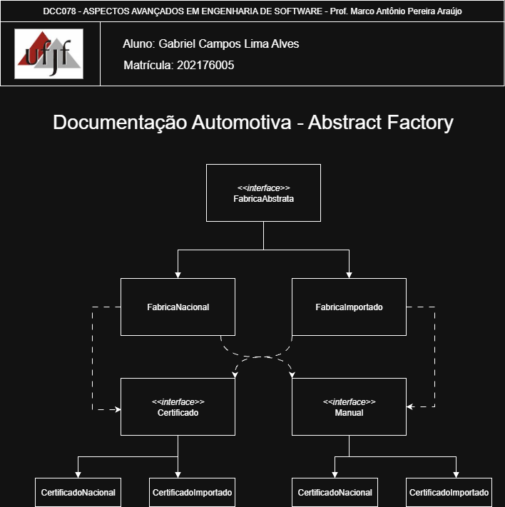

# Abstract Factory — Sistema de Documentação Automotiva

<p align="center">
  <a href="https://www.ufjf.br/" rel="noopener">
    
  </a>
</p>

<h3 align="center">DCC078-2025.3-A — Aspectos Avançados em Engenharia de Software (UFJF/ICE)</h3>

---

## 📝 Sumário
- [Sobre](#sobre)
- [Diagrama Nível de Projeto](#diagrama)
- [Funcionalidades](#funcionalidades)
- [Tecnologias](#tecnologias)
- [Exemplo de Uso](#exemplo)
- [Como Executar e Testes](#testes)
- [Autor](#autor)

## 🧐 Sobre <a name="sobre"></a>
> **Disciplina:** DCC078 – Aspectos Avançados em Engenharia de Software
> **Projeto:** Sistema de Documentação Automotiva com Abstract Factory
> **Docente:** Prof. Marco Antônio Pereira Araújo
> **Data de entrega:** 07/10/2025
> **Aluno:** [Gabriel Campos Lima Alves](#autor)

### # PadroesEstruturais-Bridge

Este projeto demonstra a implementação do padrão de projeto estrutural **Bridge** em Java.

## Padrão Bridge

O padrão Bridge é um padrão estrutural que separa uma abstração de sua implementação, permitindo que ambas variem independentemente. Ele é útil quando você tem múltiplas dimensões de variação em um sistema.

## Estrutura do Projeto

### Implementadores (Implementation)
- **GatewayPagamento**: Interface que define o contrato para os gateways de pagamento
  - **MercadoPago**: Implementação com taxa de 4,99%
  - **PagSeguro**: Implementação com taxa de 4,40%
  - **Stripe**: Implementação com taxa de 2,99%
  - **Cielo**: Implementação com taxa de 3,50%

### Abstrações (Abstraction)
- **TipoPagamento**: Classe abstrata que mantém uma referência para um GatewayPagamento
  - **CartaoCredito**: Calcula valor com parcelas e taxa do gateway
  - **Pix**: Calcula valor com taxa do gateway
  - **TransferenciaBancaria**: Calcula valor com taxa do gateway
  - **Boleto**: Retorna valor base sem taxa

## Como Funciona

O padrão Bridge permite combinar qualquer tipo de pagamento com qualquer gateway de pagamento de forma flexível. Por exemplo:
- Pagamento via Pix usando MercadoPago
- Pagamento via Cartão de Crédito usando Stripe
- Pagamento via Transferência usando Cielo

Isso evita a explosão combinatória de classes que teríamos se criássemos uma classe para cada combinação possível.

```md
# GatewayFlex Pagamentos — Padrão Estrutural Bridge

<p align="center">
  <a href="https://www.ufjf.br/" rel="noopener">
    
  </a>
</p>

<h3 align="center">DCC078-2025.3-A — Aspectos Avançados em Engenharia de Software (UFJF/ICE)</h3>

---

## 📝 Sumário
- [Sobre](#sobre)
- [Diagrama Nível de Projeto](#diagrama)
- [Funcionalidades](#funcionalidades)
- [Tecnologias](#tecnologias)
- [Exemplo de Uso](#exemplo)
- [Como Executar e Testes](#testes)
- [Autor](#autor)

## 🧐 Sobre <a name="sobre"></a>
> **Disciplina:** DCC078 – Aspectos Avançados em Engenharia de Software   
> **Projeto:** GatewayFlex Pagamentos — implementação do padrão Bridge   
> **Docente:** Prof. Marco Antônio Pereira Araújo  
> **Data de entrega:** 07/10/2025   
> **Aluno:** [Gabriel Campos Lima Alves](#autor)  

### Padrão Bridge no GatewayFlex
O projeto GatewayFlex Pagamentos usa o padrão estrutural **Bridge** para separar a abstração (tipos de pagamento) das implementações (gateways de pagamento). Essa separação permite adicionar novos métodos de pagamento e novos provedores (gateways) sem multiplicar classes para cada combinação possível.

O foco é demonstrar como arquiteturas reais (e-commerces, fintechs, plataformas SaaS) podem ganhar flexibilidade, reduzir acoplamento e facilitar manutenção ao aplicar Bridge.

## 📐 Diagrama de Classe <a name="diagrama"></a>
O diagrama abaixo representa o nível de projeto e mostra a relação entre a hierarquia de abstração (Tipos de Pagamento) e a hierarquia de implementação (Gateways):

<p align="center">
  
</p>

> Observação: o diagrama é ilustrativo do padrão aplicado; você pode substituir a imagem por um diagrama específico `Bridge.png` se preferir.

## 🚀 Funcionalidades <a name="funcionalidades"></a>
- Abstração clara entre o que é feito (tipo de pagamento) e como é feito (gateway)
- Permite combinar qualquer `TipoPagamento` com qualquer `GatewayPagamento` sem criar classes para cada combinação
- Fácil adição de novos gateways (ex.: Adyen, PayPal) ou novos métodos de pagamento (ex.: pagamento recorrente)
- Testes unitários cobrindo comportamento da abstração independente das implementações

### Componentes principais
- `GatewayPagamento` (interface) — contrato para integrações de gateway (ex.: `MercadoPago`, `PagSeguro`, `Stripe`, `Cielo`)
- `TipoPagamento` (abstração) — referencia um `GatewayPagamento` e define operações comuns (ex.: calcular valor final, aplicar taxa)
- Implementações concretas de `TipoPagamento`: `CartaoCredito`, `Pix`, `TransferenciaBancaria`, `Boleto`

## 📊 Exemplo de Uso <a name="exemplo"></a>
Exemplo mínimo de como combinar uma abstração com uma implementação:

```java
// cria o gateway concreto
GatewayPagamento stripe = new Stripe();

// cria a abstração de pagamento e injeta o gateway
TipoPagamento cartao = new CartaoCredito(stripe);

double valorBase = 100.0;
double valorPago = cartao.calcularValorFinal(valorBase);
System.out.println("Valor final (cartão via Stripe): " + valorPago);

// trocar o gateway em tempo de execução
GatewayPagamento mercadoPago = new MercadoPago();
cartao.setGateway(mercadoPago);
System.out.println("Valor final (cartão via MercadoPago): " + cartao.calcularValorFinal(valorBase));
```

Esse exemplo mostra a troca de implementação sem alterar a hierarquia de `TipoPagamento`.

## 🧪 Como Executar e Testes <a name="testes"></a>
### Pré-requisitos
- Java 11 ou superior
- Maven 3.6+

### Comandos úteis
```bash
# Na raiz do projeto
cd "c:/Users/gcamp/Videos/ASPECTOS-AVANÇADOS-ENG-SFTW/PadroesEstruturais-Bridge"

# Compilar
mvn clean compile

# Executar testes unitários (recomendado)
mvn test

# Empacotar
mvn package
```

Os testes existentes (em `src/test/java/padroesestruturais/bridge/`) verificam as implementações de `TipoPagamento` e a interação com diferentes `GatewayPagamento`.

## 🛠️ Observações práticas
- Para adicionar um novo gateway: implemente `GatewayPagamento` e foque nas chamadas de API/simulação e nas taxas aplicáveis.
- Para adicionar um novo tipo de pagamento: estenda `TipoPagamento` e reutilize o mesmo `GatewayPagamento` existente.

##  Tecnologias <a name="tecnologias"></a>
- **Java 11+**
- **JUnit 5** - Framework de testes
- **Maven** - Gerenciamento de dependências
- **Git** - Controle de versão

## 👨‍💻 Autor <a name="autor"></a>
**Gabriel Campos Lima Alves**  
Matrícula: 202176005  
Email: campos.gabriel@estudante.ufjf.br  
GitHub: [@CamposCodes](https://github.com/CamposCodes)

---

*Projeto de uso acadêmico exclusivo para a disciplina DCC078 - UFJF*

```
└── test/java/padroescriacao/abstractfactory/
