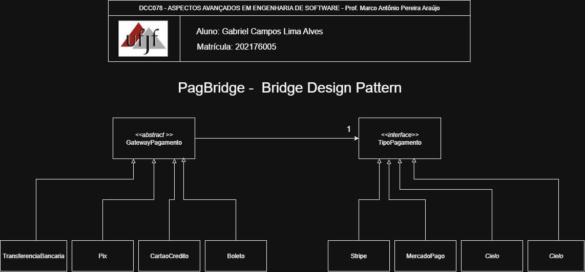

# Bridge — Gateway Flexível de Pagamento

<p align="center">
  <a href="https://www.ufjf.br/" rel="noopener">
    
  </a>
</p>

<h3 align="center">DCC078-2025.3-A — Aspectos Avançados em Engenharia de Software (UFJF/ICE)</h3>

---

## 📝 Sumário
- [Sobre](#sobre)
- [Diagrama Nível de Projeto](#diagrama)
- [Funcionalidades](#funcionalidades)
- [Tecnologias](#tecnologias)
- [Exemplo de Uso](#exemplo)
- [Como Executar e Testes](#testes)
- [Autor](#autor)

## 🧐 Sobre <a name="sobre"></a>
> **Disciplina:** DCC078 – Aspectos Avançados em Engenharia de Software   </br>
> **Projeto:** Gateway Flexível de Pagamento - Bridge   </br>
> **Docente:** Prof. Marco Antônio Pereira Araújo  </br>
> **Data de entrega:** 07/10/2025   </br>
> **Aluno:** [Gabriel Campos Lima Alves](#autor)  </br>

### Padrão Bridge
Implementação do padrão **Bridge** para separação entre abstração e implementação no contexto de sistemas de pagamento.
O **Bridge** é um padrão estrutural que desacopla uma abstração de sua implementação, permitindo que ambas variem independentemente, demonstrando:
- Separação entre tipos de pagamento (abstração) e gateways (implementação)
- Isolamento das classes concretas do cliente
- Facilita adição de novos gateways ou tipos de pagamento sem explosão combinatória de classes

## 📐 Diagrama de Classe <a name="diagrama"></a>
O diagrama abaixo representa a arquitetura do projeto, destacando a aplicação do padrão **Bridge** no sistema de gateway de pagamentos:

<p align="center">
  
</p>

## 🚀 Funcionalidades <a name="funcionalidades"></a>
### Sistema de Gateway de Pagamento Implementado
- **GatewayPagamento**: Interface para implementações de gateway
- **MercadoPago/PagSeguro/Stripe/Cielo**: Implementações concretas de gateways
- **TipoPagamento**: Classe abstrata que mantém referência ao gateway
- **CartaoCredito/Pix/TransferenciaBancaria/Boleto**: Abstrações concretas de tipos de pagamento

### Recursos
- ✅ Separação clara entre abstração (tipo de pagamento) e implementação (gateway)
- ✅ Acoplamento fraco entre tipos de pagamento e gateways
- ✅ Facilidade para adicionar novos gateways sem modificar tipos de pagamento
- ✅ Facilidade para adicionar novos tipos de pagamento sem modificar gateways
- ✅ Troca dinâmica de gateway em tempo de execução
- ✅ Evita explosão combinatória de classes

##  Tecnologias <a name="tecnologias"></a>
- **Java 11+**
- **JUnit 5** - Framework de testes
- **Maven** - Gerenciamento de dependências
- **Git** - Controle de versão

## 📊 Exemplo de Uso <a name="exemplo"></a>
```java
// Criando pagamento via Cartão de Crédito com Stripe
GatewayPagamento stripe = new Stripe();
TipoPagamento cartao = new CartaoCredito(stripe);

double valorBase = 100.0;
System.out.println(cartao.calcularValorFinal(valorBase));
// Output: Valor com taxa de 2,99% do Stripe

// Criando pagamento via Pix com MercadoPago
GatewayPagamento mercadoPago = new MercadoPago();
TipoPagamento pix = new Pix(mercadoPago);

System.out.println(pix.calcularValorFinal(valorBase));
// Output: Valor com taxa de 4,99% do MercadoPago

// Trocando gateway dinamicamente
cartao.setGateway(mercadoPago);
System.out.println(cartao.calcularValorFinal(valorBase));
// Output: Valor com taxa de 4,99% do MercadoPago

// Facilidade para trocar implementações
public void processarPagamento(TipoPagamento tipo, GatewayPagamento gateway) {
    tipo.setGateway(gateway);
    double valorFinal = tipo.calcularValorFinal(100.0);
    // Qualquer combinação de tipo de pagamento e gateway é possível
}
```

## 🧪 Como Executar e Testes <a name="testes"></a>
### Cobertura de Testes
- ✅ **Testes de Gateways**: Validam taxas e processamento de cada gateway
- ✅ **Testes de Tipos de Pagamento**: Verificam cálculos para cada tipo de pagamento
- ✅ **Testes do Padrão**: Confirmam separação entre abstração e implementação
- ✅ **Testes de Integração**: Validam combinações de tipos de pagamento com diferentes gateways

### Pré-requisitos
- Java 11 ou superior
- Maven 3.6+

### Comandos
```bash
# Compilar o projeto
mvn clean compile

# Executar testes
mvn test

# Executar o programa principal
mvn exec:java -Dexec.mainClass="padroesestruturais.bridge.Main"

# Empacotar
mvn package
```

## 👨‍💻 Autor <a name="autor"></a>
**Gabriel Campos Lima Alves**  
Matrícula: 202176005  
Email: campos.gabriel@estudante.ufjf.br  
GitHub: [@CamposCodes](https://github.com/CamposCodes)

---

*Projeto de uso acadêmico exclusivo para a disciplina DCC078 - UFJF*
